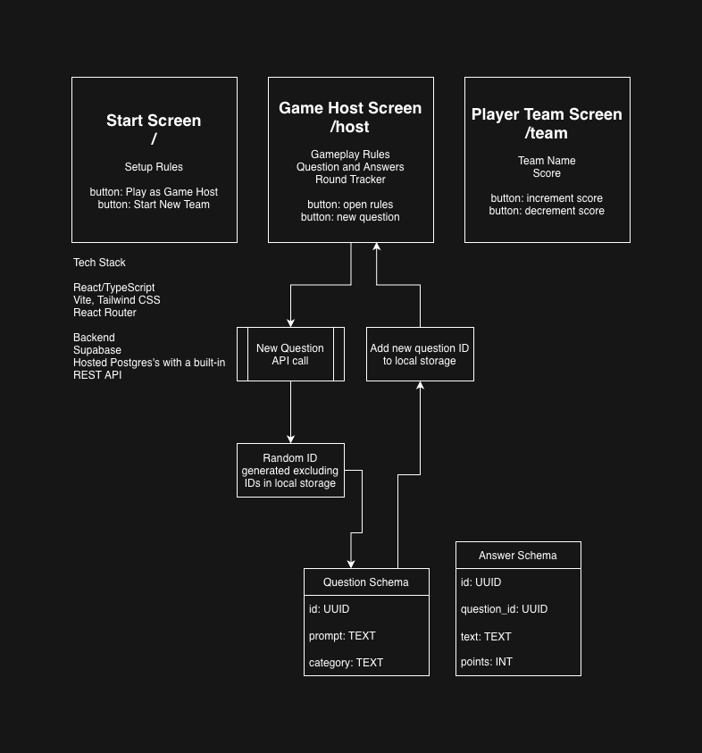

# Feudy

A Family Feud-style trivia game where a host reads questions and teams track their scores on movbile devices.

Live at [www.feudygame.com](https://www.feudygame.com)

## Tech Stack



### [React 19](https://react.dev/)

UI library used to build all game screens — the home page, host view, and team score tracker. Uses the latest concurrent rendering features.

### [TypeScript 6](https://www.typescriptlang.org/)

Provides static typing across the entire codebase. Strict mode is enabled with `noUnusedLocals` and `noUnusedParameters` enforced at build time.

### [Vite 8](https://vite.dev/)

Build tool and dev server with hot module replacement (HMR). Handles bundling for production via `npm run build`.

### [React Router 7](https://reactrouter.com/)

Client-side routing between the three app views: `/` (home), `/host` (question display), and `/team` (score tracker).

### [Tailwind CSS 4](https://tailwindcss.com/)

Utility-first CSS framework for all styling. The custom color palette (`dark-blue`, `cream`, `orange`) is defined via the `@theme` directive in `src/index.css`.

### [Supabase](https://supabase.com/)

Provides the PostgreSQL database that stores questions and answers. The client is initialized in `src/lib/supabase.ts` using `VITE_SUPABASE_URL` and `VITE_SUPABASE_PUBLISHABLE_KEY` from `.env`.

### [ESLint 10](https://eslint.org/)

Linting via flat config (`eslint.config.js`). Includes `eslint-plugin-react-hooks` and `eslint-plugin-react-refresh` for React-specific rules.

## Getting Started

```bash
npm install
cp .env.example .env   # add your Supabase credentials
npm run dev
```

## Commands

| Command           | Description                           |
| ----------------- | ------------------------------------- |
| `npm run dev`     | Start the Vite dev server with HMR    |
| `npm run build`   | Type-check, then build for production |
| `npm run lint`    | Run ESLint                            |
| `npm run preview` | Preview the production build locally  |
